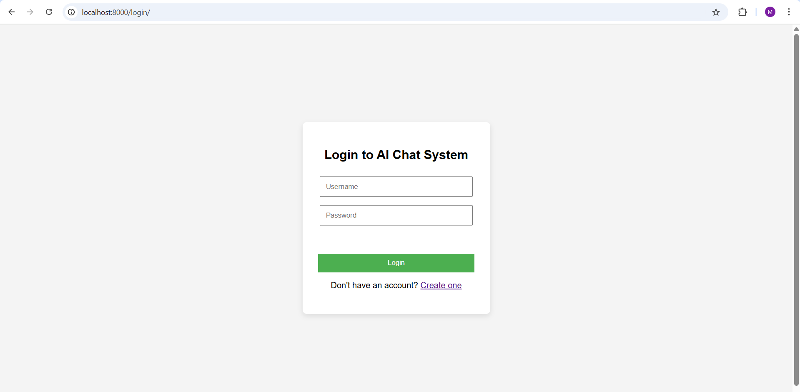
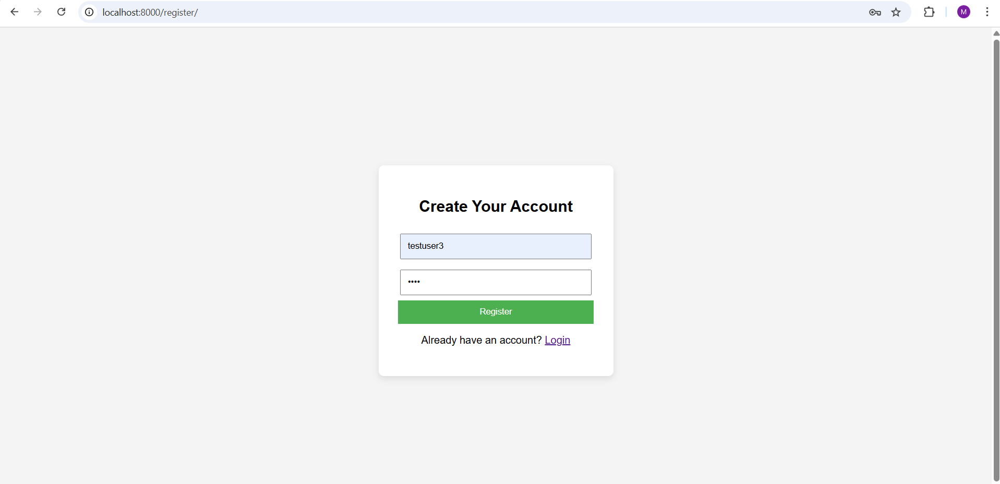
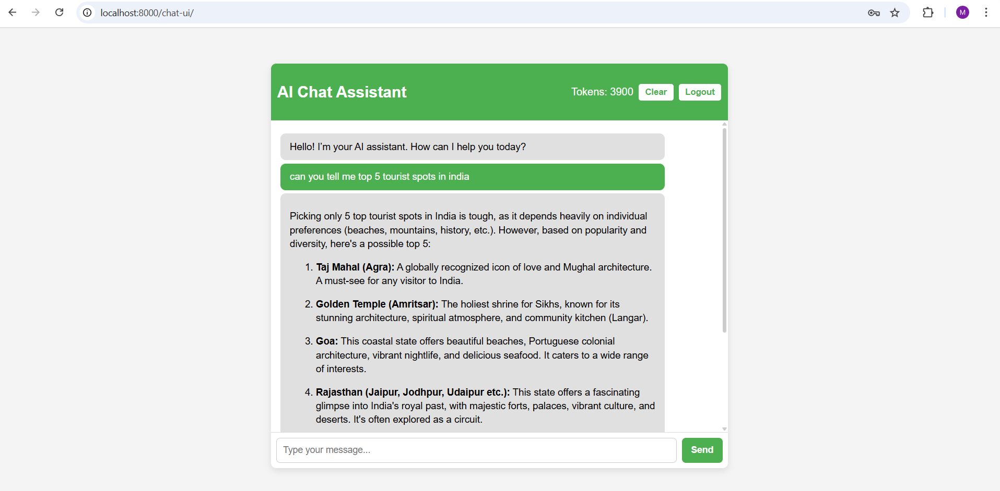

# AI Chat System (Django + PostgreSQL + Docker)

##  Overview
This is a full-stack AI Chat application built with Django REST Framework for the backend and PostgreSQL as the database, fully containerized with Docker.  

It provides:
- User registration & login using JWT authentication
- AI-powered chat interface
- Persistent storage of user data & chat history
- Easy deployment via Docker

---

##  Features
- User Authentication (Register/Login)
- JWT Token-Based Security
- AI-powered chat responses
- Persistent chat history in PostgreSQL
- Dockerized for easy setup and deployment
- Environment-based configuration using `.env`

---

## 🛠 Installation Instructions

### 1️⃣ Clone the repository

git clone https://github.com/yourusername/ai-chat-system.git
cd ai-chat-system

### 2️⃣ Create `.env` file in the project root
SECRET_KEY=your-django-secret-key
DEBUG=True
DB_NAME=ai_chat_system
DB_USER=postgres
DB_PASSWORD=your-db-password
DB_HOST=db
DB_PORT=5432
GEMINI_API_KEY=your-gemini-api-key

### 3️⃣ Build & run using Docker

docker-compose up --build

## Usage Guidelines

### Apply Database Migrations
docker-compose exec web python manage.py migrate

### Create Superuser (optional, for admin access)
docker-compose exec web python manage.py createsuperuser

### Access the Application
- Main App → Open in browser: http://localhost:8000/login  
- Admin Panel → http://localhost:8000/admin (requires superuser credentials)

##  Screenshots

### Login Page


### Create Account


### Chat Page


## API Testing Via Postman

### User Registration API


### User Login API


### Chat API


### Token Balance API


##  Challenges Encountered
- Handling environment variables securely inside Docker.
- Ensuring PostgreSQL and Django connect properly via the Docker network.
- Running database migrations inside containers.
- Managing static files correctly in a Docker environment.

## Suggestions for Improvement
- Integrate real AI backend (e.g., OpenAI, Gemini, or LLaMA).
- Add WebSocket support for real-time chat.
- Enable chat history export.
- Implement profile customization and theme switching.


##  Architecture
```text
+------------------+       +--------------------+       +-------------------+
|  Frontend (HTML, | <---> |  Django REST API   | <---> |  PostgreSQL DB    |
|  CSS, JS)        |       |  (Docker Service)  |       |  (Docker Service) |
+------------------+       +--------------------+       +-------------------+
```

##  License
This project is for educational purposes only.
